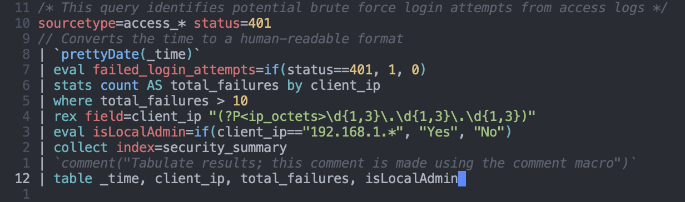

<h1 align="center">splunk-mode</h1>

[](https://melpa.org/#/splunk-mode)
[](https://stable.melpa.org/#/splunk-mode)
[](https://github.com/jakewilliami/splunk-mode/actions/workflows/test.yml)

[Emacs](https://www.gnu.org/software/emacs/) major mode for editing [Splunk SPL](https://splunk.com/) source code.



See also: [`logscale-mode`](https://github.com/jakewilliami/logscale-mode/).

## Installation

### Installing from MELPA

`splunk-mode` is available on MELPA (as of [melpa/melpa#9005](https://github.com/melpa/melpa/pull/9005)).  Using MELPA to install `splunk-mode` is the recommended way to use this package.  You will need to:
  1. [Enable the MELPA repository](https://melpa.org/#/getting-started)
  2. Enable the package by adding the following lines to your Emacs init file (e.g., `~/.emacs`):
```elisp
(package-install 'splunk-mode)
(require 'splunk-mode)
```

### Installing from Source

To get the latest version of `splunk-mode`, clone this repository and then use:
```elisp
(add-to-list 'load-path "<path to splunk mode>")
(require 'splunk-mode)
```

## Citation

If your research depends on `splunk-mode`, please consider giving us a formal citation: [`citation.bib`](./citation.bib).
